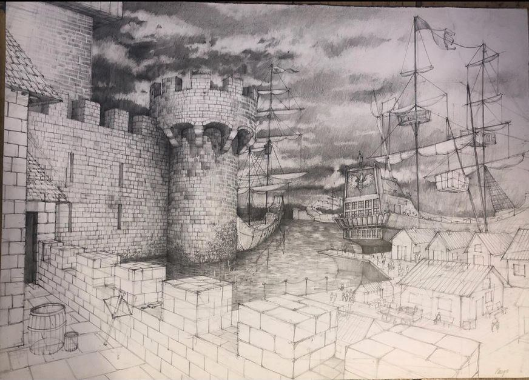

{width="300px"}

# Title and Summary
Inspired by the drawing of one of our members, we want to bring the scene she drew to 3D. It's a medieval force that will be procedurally generated to get different versions of it!
Type of result: interactive scene or visualization
Image and effect we want to achieve on (images/castle_unity.jpg){width="300px"}

# Goals and Deliverables

Describe the goals of your project here, following the
[project instructions](https://lgg.epfl.ch/teaching/ICG2019/icg_lectures/2019_project_instructions).

4.0 Have a simple castle generation working with the wave function collapse algorithm in a realistic environment created in Unity.
5.5 
- Be able to generate more complex castles with different towers, walls, etc.
- Be able to procedually generate a small village inside the castle
- Be able to chance the color of the castle

TODO Carefully describe either the kind of images, animations, or interactive demos your functioning project will create.
5 scenes with 5 different procedurally generated castles created in Unity, that can be compared with the drawing of the castle that we initially thought of and the castle we created arbitrary in week 2.

# Schedule
Because we managed to split the tasks equally in the previous labs, we think that we work better as a team, rather than each of us work on different parts of the projects. In case of someone taking more care of a specific task, we will let you know in the final report.
Specific plan on when and by whom tasks will be completed.
WEEK 1:
- Investigation and reading on how the wave function collapse algorithm works
- Find a base kit to create a more complex castle
- Think how to use that algorithm with our objects from the castle kit

WEEK 2:
- Creation of the project structure and classes in Unity
- Creation of the environment in which we are going to put the castle Unity
- Get familiarized with the objects of castle kit we are going to use by creating a small castle, for example. Check  it's used, as well as how to import it.
- Check how the scene looks with an arbitrary castle to make sure that the objects from the castle kit we are going to use work fine and look good.

WEEK 3:
- Start with the implementation of the wave function collapse algorithm
- Learn to use Unity because none of us already knows how to use it

WEEK 4:
- Choose a subset of the kit that will be passed to the algorthm and specify, for each of them, they coordinates so we can adapt the algorithm to our problem.
- Keep working on the algorithm
- Start the report

WEEK 5:
- Make sure everything is working properly
- Finish the report

# Resources

List your dependencies...
The idea of the algorithm we plan to implement:
https://scaleyourapp.com/procedural-generation-a-comprehensive-guide-in-simple-words/
https://www.youtube.com/watch?v=Jsc3BQaJndQ
https://www.youtube.com/watch?v=tyS7WKf_dtk
https://dev.to/kavinbharathi/the-fascinating-wave-function-collapse-algorithm-4nc3

We will be using Unity and Blender for that.